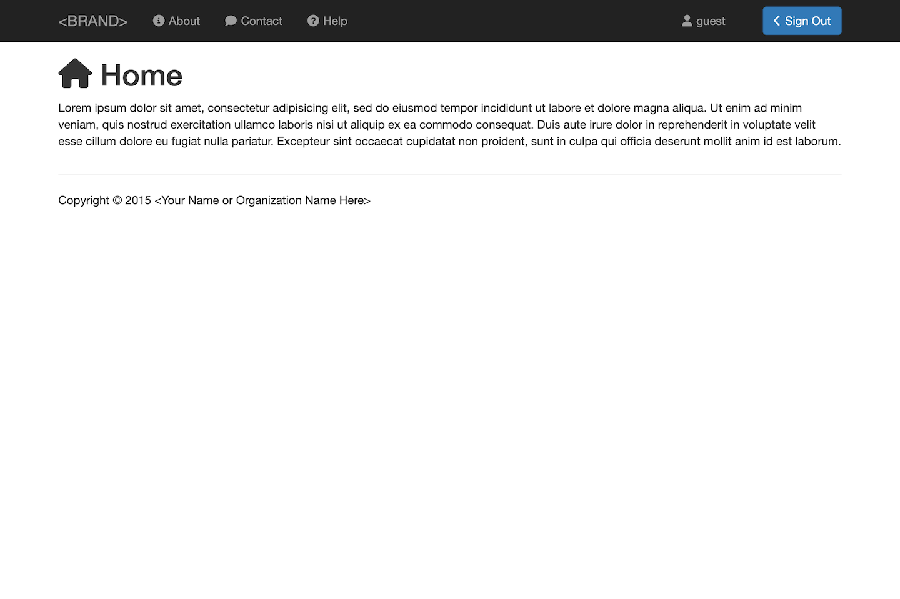

    

# Authentication

This is a base framework for building web applications that require user account registration and authentication.

  

This framework provides the following functions:

#### 1. Registration 
Allow users to create new accounts.

#### 2. Authentication
Allow users to sign in using a username and password. 

#### 3. Email Verification 
User accounts are verified through email to prevent malicious account creation.

#### 4. Password Reset
Allow users to reset their password in case they have forgotten it.

#### 5. Username Recovery
Allow users to recover their username in case they have forgotten it.

#### 6. User Profile Management
Allow users to add information about themselves such as their name to their user profile.

## Screen Shots

To view screen shots of the user interface, click [here](SCREENSHOTS.md).

## Requirements

#### 1. PHP 8.2
This framework uses PHP 8.2 for the back end web services.

#### 2. SQL Database
User data is stored in a SQL database.  You will need MySQL, MariaDB, or an equivalent.

## Installation

Installation instructions can be found [here](INSTALL.md)

## Technologies

#### 1. Bootstrap
This framework uses the Bootstrap framework for the client user interface.

#### 2. Marionette
Additionally, the Marionette framework is used on the client side for managing views and events.

#### 3. Laravel
This utility uses the Laravel framework for the back end web services.

<!-- LICENSE -->
## License

Distributed under the MIT License which allows urestricted use of the software. See [LICENSE.txt](LICENSE.txt) for more information.

<!-- CONTACT -->
## Contact

Abe Megahed - (mailto:amegahed@wisc.edu)
