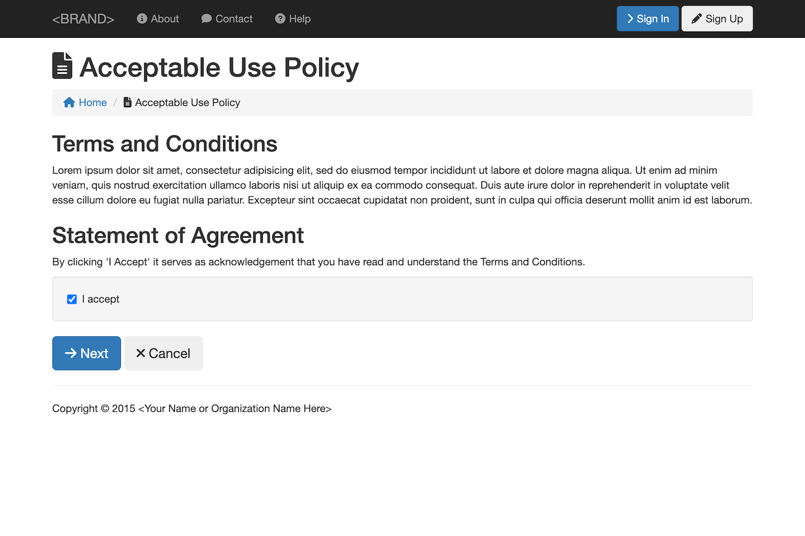

  

    
  

# Screen Shots

Below are some screen shots of the user interface:

### 1. Welcome
This is the first view that you see upon visiting the application

## Registration

Below are screen shots involved in the account registration process.

### 1. AUP
When you first click the "Sign Up" button, you will be shown some terms to agree to:

### 2. Registration Form
Next, users will fill out a simple registration form:

### 3. Verify Email Address
After clicking on a link sent to the user's email, they will be asked to verify their email address, thereby activating their account:

## Authentication

Below are screen shots involved in the authentication process.

### 1. Sign-In
This is the view that you see after clicking the Sign-In button

### 2. Home
This is the view that you see after clicking the Sign-In button

### 3. My Account 
This is the view that you see after clicking on your username in the header after signing in.

### 4. Edit My Profile 
This is the view that you see after clicking on the "Edit Profile" button on the "My Account" page.

